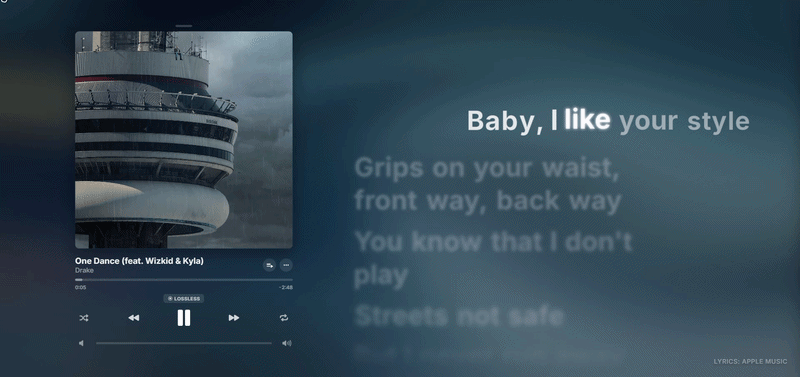

  <h1>Spicy AMLL Player</h1>
  
<strong>A premium, high-fidelity music experience built for those who love lyrics as much as the beat.</strong>

  

    
    
    
  

   

  

---

## 🎧 The Vision

Music is more than just audio; it's an atmosphere. **Spicy AMLL Player** was made with a desire to bring the stunning, glassmorphism-driven aesthetics of Apple Music for free to the web. Every pixel is crafted to make your lyrics breathe, dance, and glow in sync with your favorite tracks.

We didn't just build a player — we built a stage for your music.

## ✨ Key Experiences

### 🌈 Immersive Visuals
- **Glassmorphism UI**: A deep, semi-transparent interface that adapts to your album art.
- **Dynamic Backgrounds**: Real-time color extraction that paints your screen with the soul of the track.
- **Animated Artwork**: Support for Apple Music-style video covers that bring your library to life.

### ✍️ Precision Lyrics
- **Word-Level Sync**: Experience lyrics that scale, glow, and transition with syllable-level accuracy.
- **TTML & LRC Support**: Full compatibility with advanced TTML formats and classic LRC files.
- **Simple Mode**: A minimalist animation path for those who prefer clean, focused transitions.

### 🛠️ Total Control
- **Provider Manager**: Switch between lyrics sources (Spicy API, Apple Music, Musixmatch, LRCLIB, Netease) on the fly.
- **Metadata Mastery**: Robust parsing for ID3 and FLAC tags, ensuring every track looks its best.
- **Meme Modes**: Because life shouldn't be too serious — toggle **Gibberish** or **Weeb** mode for a laugh.

## 🚀 Getting Started

**No installation. No complexity. Just your music.**

1.  **Launch**: Visit the [Official Site](https://spicy-amll-player.netlify.app).
2.  **Play**: Drag and drop your audio files (MP3/FLAC) and optional lyrics (.ttml) or just play from the Apple Music Catalog!
3.  **Immerse**: Sit back and watch your music transform.

---

## 📜 Legal & Credits

### San Francisco Pro Fonts
This project uses San Francisco Pro Fonts, obtained from the [Apple Developer Fonts](https://developer.apple.com/fonts/) portal. All rights belong to Apple Inc.

### Licensing
Spicy AMLL Player is licensed under the **GNU Affero General Public License v3**. See the [LICENSE](LICENSE) file for more details.

### Acknowledgments
A premium unofficial remake of the original [Spicy Lyrics](https://github.com/Spikerko/spicy-lyrics).

---

  made using the models of antigravity and with the collaborators of this project and me lol

